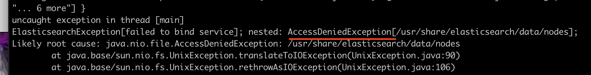
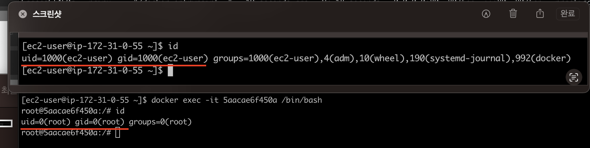
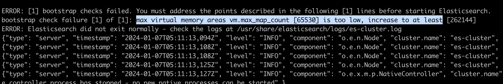
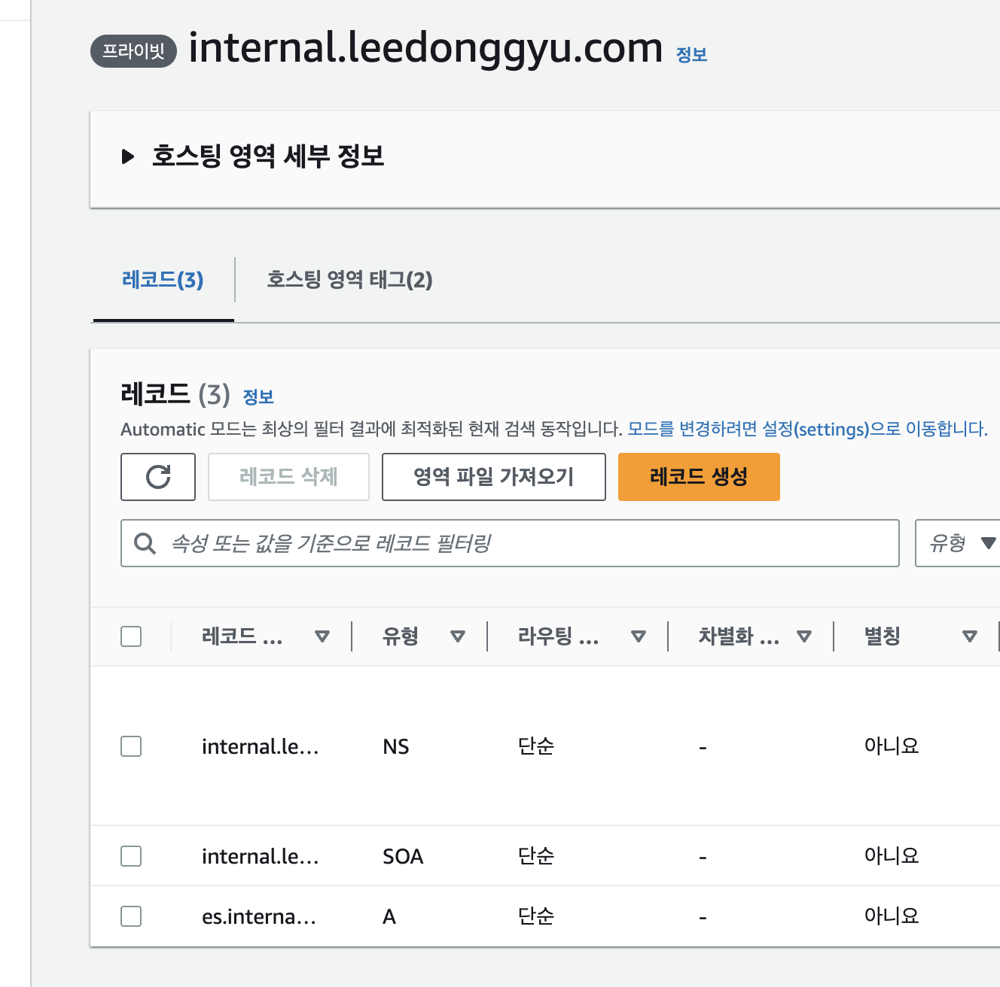

# 회고

## Docker

### 1. Docker-volume Access Denied Issue



- Linux 내에서 Docker-volume을 내부 스토리지로 사용하는데 AccessDenied 발생
- 기본적으로 Host OS와 Docker 내에서는 UID와 GID가 동일하지 않다.



- 물론 sudo chmod 777 volumes/* 하면 되긴하는데 이러면 보안상 좋지 않으니...
- docker-compose 파일에 uid와 gid를 설정하자

## ElasticSearch

### 1. ElasticSearch t4g.small 인스턴스 중지

    - ElasticSearch (Mater-1개, Slave 2개) 순간적으로 Memory가 2GB가 오름
    - t4g.small의 경우 메모리가 2GB 터저버림 -> t4g.medium로 수정 

### 2. max virtual memory areas vm.max_map_count [65530] is too low, increase to at least



- vm.max_map_count라는 값은 프로세스가 가질수 있는 최대 메모리 맵 영역 수 ( Default 65,536 )
  - ES의 경우, 메모리내의 데이터를 빠르게 검색하기 위해 많은 매핑을 필요로 함
  - ES에서 사용하는 Lusene 라이브러리에서 가상 메모리매핑을 위해 요구
  - Lusene은 많은 수의 파일을 동시에 열어야 할때 가상메모리의 매핑을 요구
  - 결국, ES를 검색할때 Lusene의 라이브러리르 사용하여 많은 수의 파일을 열어야하는데 그때 필요함

- ElasticSearch 같은 다른 유형의 소프트웨어를 구성할때 해당 값을 늘려줘야 한다.

```sh

    ## 초기 vm.max_map_count 값
    sysctl vm.max_map_count

    ## 일시적으로 변경
    sysctl -w vm.max_map.count=262144

    ## 영구적으로 변경
    sudo vi /etc/sysctl.conf

    # 작성
    vm.max_map_count=262144

    ## 적용
    sysctl -p
```

## filebeat

- 권한문제

    - 기존 권한이 root로 설정되어 있음
    - 1000 으로 수정 (현재 호스트의 uid)

```yml
    hipper:
    image: docker.elastic.co/beats/filebeat:7.16.2
    container_name: shipper
    user: root ## 이게 문제 
    volumes:
      - ./config/filebeat.yml:/usr/share/filebeat/filebeat.yml
      - ./volumes/webserver-log:/var/log/nginx
```

## hosting 문제해결

- 사실 이건 여러가지 해결방법이 존재한다
- 1. 그냥 각각 ES, LogStash, Kibana, Webserver의 IP를 Private Route53을 해도 된다.

    

- 2. 중간에 Private IP로 Reverse Proxy를 해줄 수 있는 nginx를 하나 구성해서 통신해도 된다.
- 그냥 귀찮아서 잘 안함..

## After Todo...

- [ ] 각각 설정파일이 바뀔때, 무중단 배포를 신경써야 할듯
- [ ] LogStash를 잘 사용하는 법을 익혀야 함
- [ ] *-Beat 여러제품을 한번 사용해보자